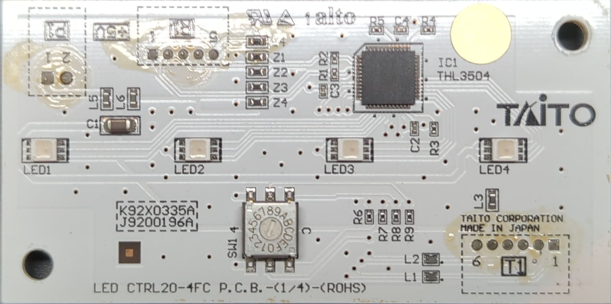
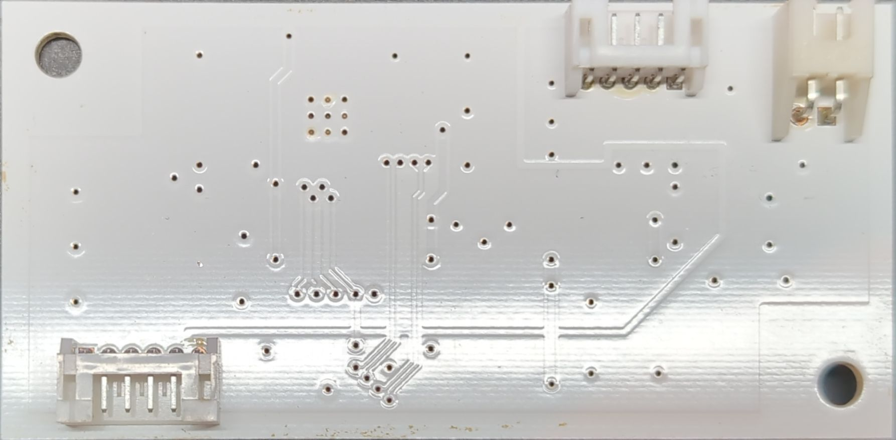

# GC2040

A Groove Coaster controller for PC and Nintendo Switch that uses boosters from an official Groove Coaster arcade cabinet, aiming to replicate the authentic arcade experience at home.

As mentioned above, this project uses a pair of official Groove Coaster arcade cabinet boosters.
I found a pair on [Yahoo! Auctions Japan](https://auctions.yahoo.co.jp/) (note: you’ll need a VPN).
For purchasing and shipping, I used [Japan Rabbit](https://japanrabbit.com/), which worked great.

## Controls

TODO: describe the inner working of the Groove Coaster boosters and how the input is handled by the Pico.

## Lighting system

The original lighting system in the Groove Coaster boosters uses eight custom LED boards for side lighting and one custom LED board for top lighting.
Each board has four LEDs controlled by a [Thine THL3504 LED driver](https://www.mouser.com/datasheet/2/286/THL3504-1396212.pdf).
These LED drivers support both 3-wire serial CMOS and 2-pair serial LVDS input, with LVDS being configured on these boards.

To use these LED drivers with the Pico, the easiest approach is to configure the first LED driver for 3-wire serial CMOS communication.
This lets the Pico and the first LED driver communicate over SPI, while the LED driver converts the signal to LVDS for the remaining drivers in the chain. However, because the LED drivers are hard-wired for LVDS, the only way to achieve this is by modifying the original LED boards.

Because I'm not comfortable soldering on such a small scale, and I don't want to destroy the original LED board, I've decided to replace the original lighting system with a NeoPixel-based one.
This allows me to leave the original LED boards intact and, as an added benefit, makes the lighting system compatible with existing Arduino libraries like [FastLED](https://github.com/FastLED/FastLED).
